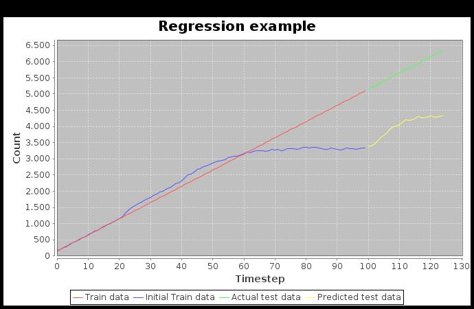

= Dl4j Recurrent Neural Network Regression Test

This project is used for testing and evaluating the capabilities of Recurrent Neural Networks for regression problems written with Dl4j.
It is inspired by and uses parts of this example: https://github.com/deeplearning4j/dl4j-examples/commit/53bcac436d118419e1153f00a72134488d73efaf .
The example has been removed from the official GitHub, the reason for that can be found here: https://github.com/deeplearning4j/dl4j-examples/pull/559 .

== Tests:

Two JUnit tests can be found at src/test/java/rnn which implement and test the neural network:

* Dl4jTestSingle: predicts a single timestep
* Dl4jTestMulti: predicts several timesteps 

The single timestep example is just for testing and should not be used in a productive way because it misses the point of RNNs. 
The idea of RNNs is to predict a smaller timestep and add that to the trained model so the following timestep is predicted in respect of the previous one/ones.

== Example Data:

There are currently 3 different examples found at src/test/resources:

* linreg: Simple linear regression example with perfect fitting data
* sinus: Sinus like function
* passengers: Example dataset from the dl4j example Github Repository, found here: https://github.com/deeplearning4j/dl4j-examples/tree/f6baf6ac1733290167f541f27d0840b2156cc550/dl4j-examples/src/main/resources/rnnRegression

== Problems:

* multi timestep test is not working: when initializing the training data the first step seems to fit okay to the real values but from there on it gets worse and worse:

Multi Timepstep Regression with 30000 (!!) iterations

* learning rate must be 0.001 or lower otherwise the predicted test data consists of non real numbers (try it out and look at console)
* number of iterations have to be 5000 or higher to get good predictions which results in long training times ( >5min with my setup)
* backpropagation seems to have a negative effect on the prediction
