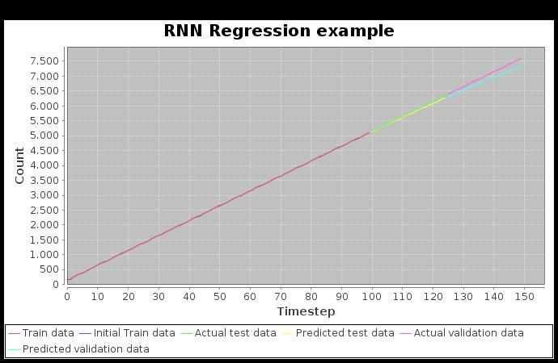

= Dl4j Recurrent Neural Network Regression Test

This project is used for testing and evaluating the capabilities of Recurrent Neural Networks for regression problems written with Dl4j.
It is inspired by and uses parts of this example: https://github.com/deeplearning4j/dl4j-examples/commit/53bcac436d118419e1153f00a72134488d73efaf .
The example has been removed from the official GitHub, the reason for that can be found here: https://github.com/deeplearning4j/dl4j-examples/pull/559 .

== Tests:

The test can be found at src/test/java/rnn which sets up, trains and tests the neural network at once. 
A generated plot lets you evaluate how well the prediction went.

== Example Data:

There are currently 3 different examples found at src/test/resources:

* linreg: Simple linear regression example with perfect fitting data
* sinus: Sinus like function
* passengers: Example dataset from the dl4j example Github Repository, found here: https://github.com/deeplearning4j/dl4j-examples/tree/f6baf6ac1733290167f541f27d0840b2156cc550/dl4j-examples/src/main/resources/rnnRegression

== Problems:

* learning rate must be 0.001 or lower otherwise the predicted test data consists of non real numbers (try it out and look at console)
* number of iterations have to be at least 5000 to get good predictions which results in long training times ( >5min with my setup)
* backpropagation seems to have a negative effect on the prediction
* Even after exhausting parameter tuning there are still some more or less major differences between real and predicted data. For the linreg dataset the values somehow flatten with every time step: 

 

