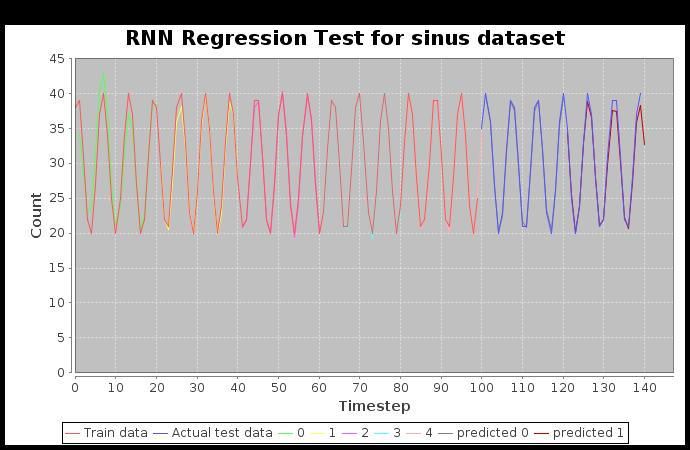

= Dl4j Recurrent Neural Network Regression Test

This project is used for testing and evaluating the capabilities of Recurrent Neural Networks for regression problems written with Dl4j.
It is inspired by and uses parts of this example: https://github.com/deeplearning4j/dl4j-examples/commit/53bcac436d118419e1153f00a72134488d73efaf .
The example has been removed from the official GitHub, the reason for that can be found here: https://github.com/deeplearning4j/dl4j-examples/pull/559 .

== Tests:

The test can be found at src/test/java/rnn which sets up, trains and tests the neural network at once. 
Just specify the static parameters and run the test. It takes about 2 minutes. A generated plot lets you evaluate how well the prediction went.
Be aware that you have to stop the JUnit Test manually because of an endless for loop to hold the plot.
The plot is stored at a specified directory, be sure to check that.
The data is loaded from one CSV file (e.g. linreg_raw.csv). This file is split in a train and a test set. 
These sets again are split into smaller time series. One series consists of several features and one label.
Every feature and label represents a single time step in the series, in which the label is the last step and the value to be predicted. 

== Example Data Sets:

There are 3 different example data sets found at src/test/resources:

=== linreg: 
Simple linear regression example with perfect fitting data

.Iterations: 75; Learningrate: 0.2; Hidden Layers: 10
 

=== sinus:
Sinus like function

.Iterations: 50; Learningrate: 0.15; Hidden Layers: 50
 

=== passengers: 
Example dataset from the Dl4j example Github Repository, found here: https://github.com/deeplearning4j/dl4j-examples/tree/f6baf6ac1733290167f541f27d0840b2156cc550/dl4j-examples/src/main/resources/rnnRegression

.Iterations: 100; Learningrate: 0.3; Hidden Layers: 10
 

== Problems:

* predictions for first time steps of training data is very bad especially for linreg dataset
* prediction for test sets gets worse over time
* backpropagation seems to have a negative effect on the prediction

